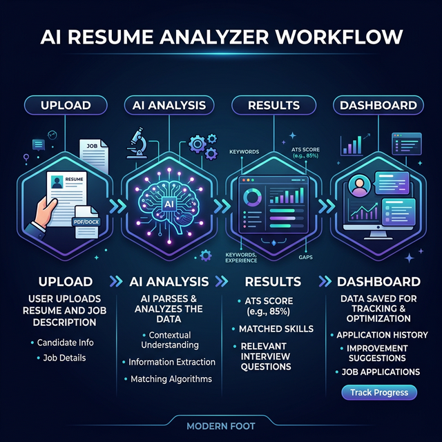
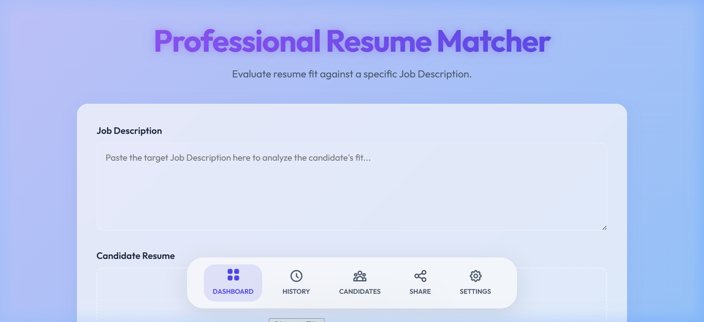
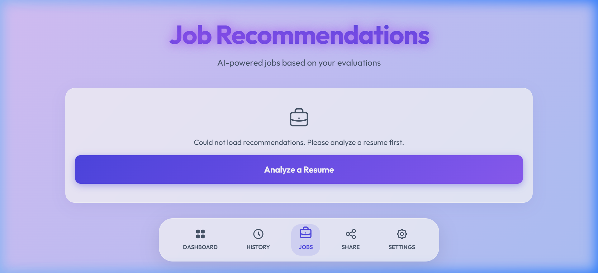
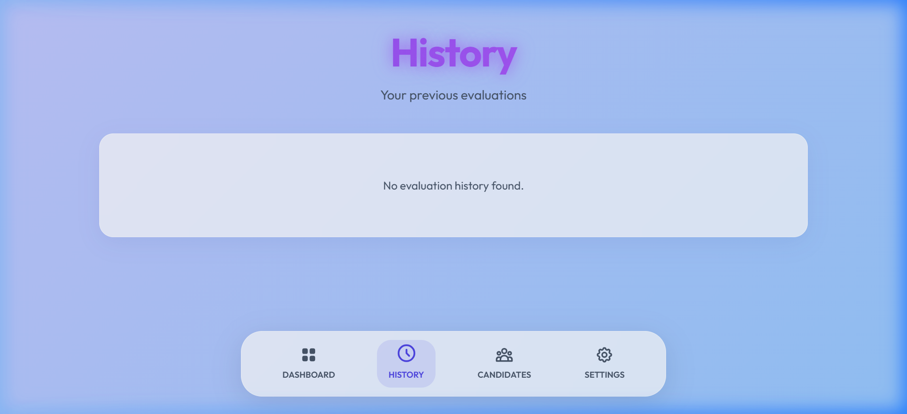
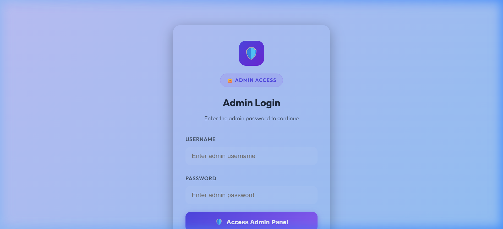

# AI Resume Analyzer 📄🚀

An intelligent, AI-powered resume analysis and tracking system built with **Python**, **Flask**, and **Google Gemini AI**. This tool helps recruiters and job seekers evaluate resume fit against specific job descriptions with high precision.

## 🌟 Key Features

- **AI Parsing & Analysis**: Uses Google Gemini Pro to extract skills, experience, and contact info from PDF/DOCX files.
- **ATS Scoring**: Provides a match score out of 100 based on the provided Job Description.
- **Matched & Missing Skills**: Instant identification of skill gaps and key strengths.
- **Tailored Interview Questions**: Generates 3-5 specific questions based on the candidate's profile.
- **Job Recommendations**: Recommends relevant roles based on evaluation history.
- **Admin Dashboard**: Comprehensive tracking of all evaluations, candidate profiles, and session history.
- **Persistence**: Powered by **Supabase** for secure and scalable data storage.

## 🛠️ Tech Stack

- **Backend**: Flask (Python 3.x)
- **AI Engine**: Google Gemini AI (Generative AI)
- **Database**: 
  - **Supabase** (PostgreSQL) for History and Candidates
  - **SQLite** for Admin Authentication
- **Frontend**: Modern HTML5, CSS3 (Glassmorphism design)
- **Deployment**: Vercel-ready configuration

## 🚀 Getting Started

### Prerequisites
- Python 3.8+
- Google Gemini API Key
- Supabase Project (URL and Anon Key)

### Installation

1. **Clone the repository**:
   ```bash
   git clone https://github.com/hemanthroot/AI-RESUME-ANALYZER.git
   cd AI-RESUME-ANALYZER
   ```

2. **Install dependencies**:
   ```bash
   pip install -r requirements.txt
   ```

3. **Configure Environment Variables**:
   Create a `.env` file in the root directory:
   ```env
   GEMINI_API_KEY=your_gemini_api_key
   SUPABASE_URL=your_supabase_url
   SUPABASE_KEY=your_supabase_anon_key
   FLASK_SECRET_KEY=your_secret_key
   ADMIN_PASSWORD=admin123
   ```

4. **Run the application**:
   ```bash
   python main.py
   ```
   Open `http://localhost:5000` in your browser.

## 🤖 How It Works

1. **Upload**: User provides a Job Description and a Resume (PDF/DOCX).
2. **AI Processing**: Gemini AI parses the resume text and compares it against the job requirements.
3. **Scoring**: A detailed JSON response is generated containing scores, matched skills, and missing requirements.
4. **Tracking**: Data is automatically saved to Supabase, allowing users to track their evaluation history and candidate recommendations.

## 📊 Working Process & Interface

### AI Analysis Workflow


### Application Screenshots

| Home / Upload Page | AI Job Recommendations |
| :---: | :---: |
|  |  |

| History & Tracking | Admin Access Panel |
| :---: | :---: |
|  |  |

---
Built with ❤️ by [Hemanth](https://github.com/hemanthroot)
